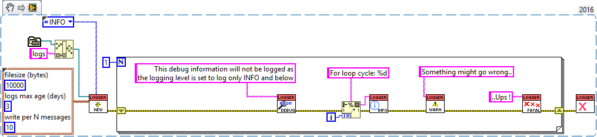

# global-logger
Simple logging utility with log levels - run in global scope.

# motivation
There are quite a few logging packages around - this one tries to be a very simple variant, which doesn't require to be wired thorughout the application but uses a FGV instead. It introduces several logging levels to allow for easy control of the depth of logged information.

# usage
All you need is initialize your logger at the start of your application. Then log by specific level wherever in your application. Close the logger afterwards.


This snippet will produce the following in the `application_directory/logs/[year]/[month]/[day]/[date_time].csv`:
```
15:21:40.630 23.10.2018, INFO, For loop cycle: 0, Global_logger.lvlib:Example.vi

15:21:40.630 23.10.2018, WARN, Something might go wrong.., Global_logger.lvlib:Example.vi

15:21:40.630 23.10.2018, FATAL, ..Ups !, Global_logger.lvlib:Example.vi

```
# features
- Globally accessible logger
- Six logging levels
- Error wire check & error logging
- Output to .csv file 
  - year/month/day folder structure
  - configurable file size
  - configurable maximum logs age


# next
Contibutions welcome!
## ideas for future versions
- timestamp formatting
- option to specify log format/layout
- multiple named loggers
- more output file formats
- more intelligent Writer.vi - auto-adjustable number of log lines in one write operation
